# Homelab: IT Support Lab Build (AKVLAB)

I built this lab to practise the core of an entry level IT support / sysadmin role: standing up a small Active Directory domain, applying policy through Group Policy, building a permission model for a departmental file share, and running realistic help desk scenarios through to a logged ticket. It is a two VM lab, not a production environment, and the value is in the workflow and the troubleshooting rather than in scale.

**Environment:** one Windows Server 2022 domain controller (`WIN-QCCH93AVUST`, `10.0.2.15`, domain `akvlab.local` / NetBIOS `AKVLAB`) and one domain joined Windows 11 client (`10.0.2.20`), both on a VirtualBox internal network (`akvlab-net`).

## Homelab Block Diagram

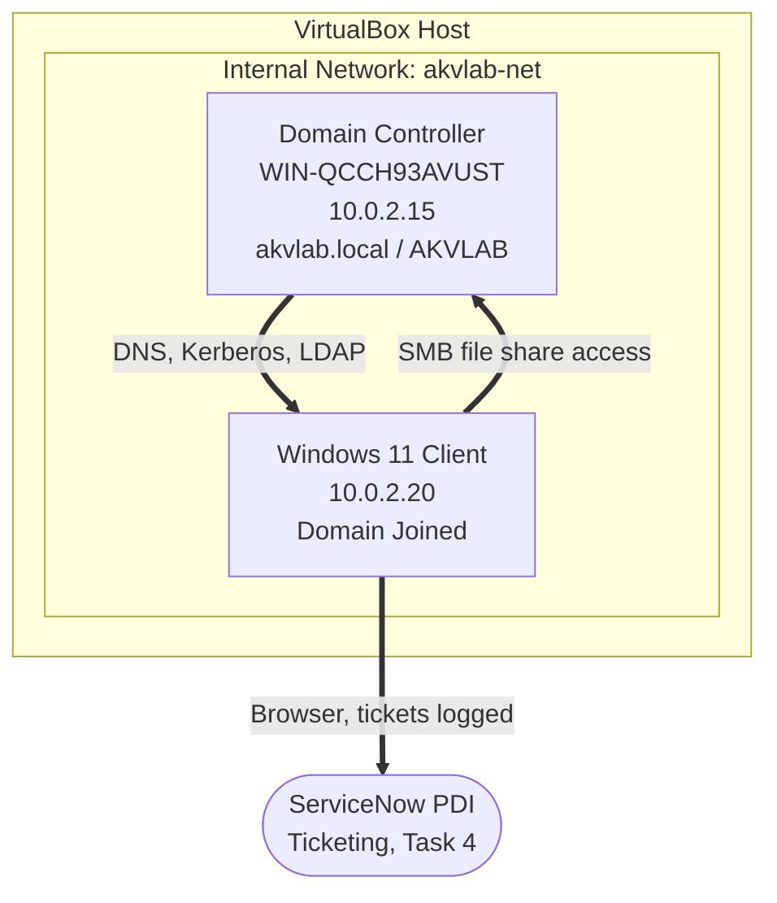
```mermaid
flowchart TB
    subgraph VBox["VirtualBox Host"]
        subgraph Net["Internal Network: akvlab-net"]
            DC["Domain Controller<br/>WIN-QCCH93AVUST<br/>10.0.2.15<br/>akvlab.local / AKVLAB"]
            Client["Windows 11 Client<br/>10.0.2.20<br/>Domain Joined"]
        end
    end
    SNow(["ServiceNow PDI<br/>Ticketing, Task 4"])

    DC ==>|DNS, Kerberos, LDAP| Client
    Client ==>|SMB file share access| DC
    Client ==>|Browser, tickets logged| SNow
```

## Skills Demonstrated

* Active Directory administration: OU structure, security groups, least privilege group membership
* DNS verification and troubleshooting using SRV record lookups
* Windows client domain join and network profile troubleshooting
* Group Policy: password policy, interactive logon banner, and independent verification of applied settings
* Windows file share design: layered share and NTFS permissions, broken inheritance, effective access testing
* Access control troubleshooting: GUI dialogs that silently fail to save, misapplied ACEs, stale logon tokens
* PowerShell for verification and diagnostics, including Get-ADDefaultDomainPasswordPolicy, Get-SmbShare, Get-Acl and whoami
* ITSM ticket handling in ServiceNow: incident versus service request classification, work notes versus customer facing resolution notes
* Root cause documentation, including catching a misconfiguration during later work that earlier verification had missed

* **Task 1:** Built a Windows 11 client VM and joined it to the domain. Key skill: DNS verification, domain join, network profile troubleshooting.
* **Task 2:** Configured a domain password policy and a logon banner via GPO. Key skill: Group Policy configuration and verification.
* **Task 3:** Built a departmental file share with a layered share and NTFS permission model. Key skill: Share/NTFS permission modelling, access troubleshooting.
* **Task 4:** Ran two help desk scenarios end to end and logged them in ServiceNow. Key skill: Incident/request handling, ticket documentation.

**Tools used:** Oracle VirtualBox, Windows Server 2022, Windows 11, Active Directory Users and Computers, Group Policy Management, PowerShell, ServiceNow Personal Developer Instance.

***

## Task 1: DNS Verification, Client VM Setup, Domain Join

**Objective:** Stand up a Windows 11 client VM and join it to the `akvlab.local` domain.

**Steps Taken**
* Verified DNS resolution against the domain controller with an SRV record lookup before attempting the join
* Built the Windows 11 client VM in VirtualBox on the `akvlab-net` internal network
* Set a static IP of `10.0.2.20` on the client with DNS pointed at `10.0.2.15`
* Joined the client to the `akvlab.local` domain and confirmed the join

**Issue Encountered and Fix**
After switching the domain controller from NAT to a VirtualBox internal network, the client's network profile defaulted to Public. That blocked LDAP and Kerberos traffic and the domain join failed. Fixed with `Set-NetConnectionProfile -NetworkCategory Private`.

**Screenshots**

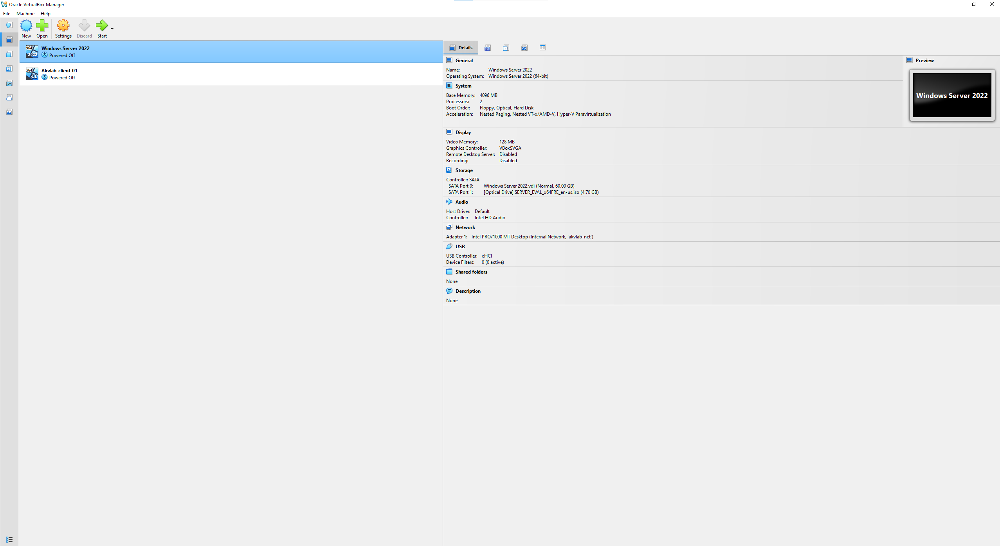
Both VMs, domain controller and client, running on the akvlab-net internal network.

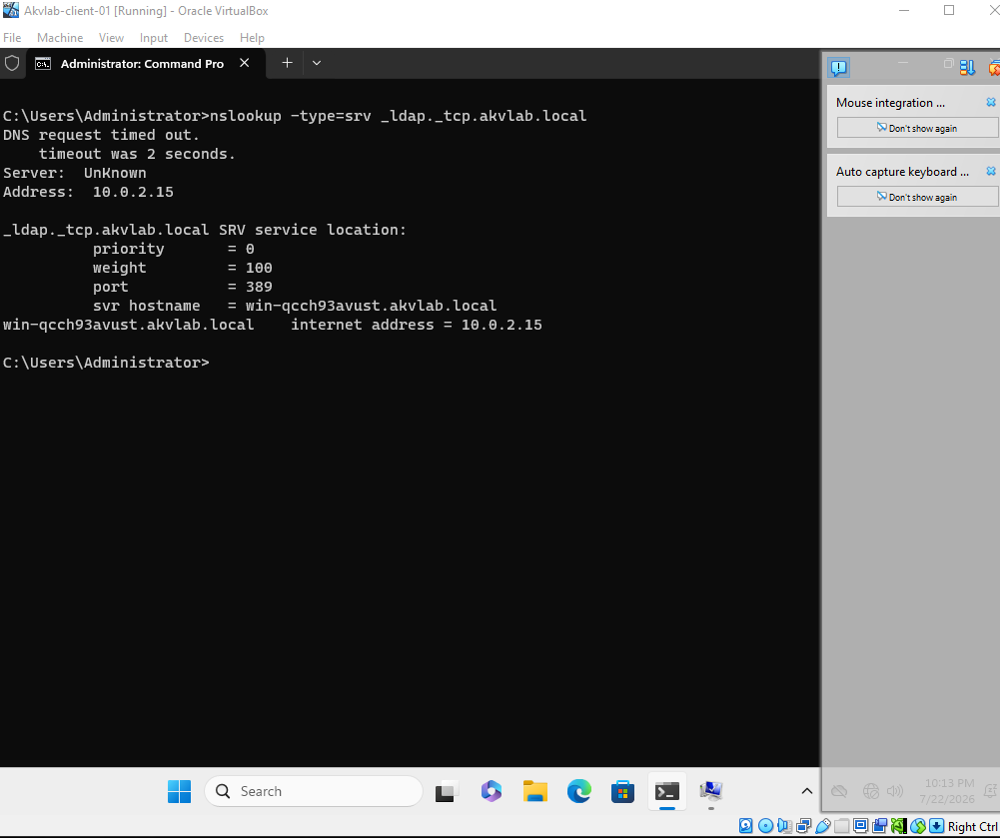
nslookup SRV record query for _ldap._tcp.akvlab.local from the client, resolving to the domain controller at 10.0.2.15.

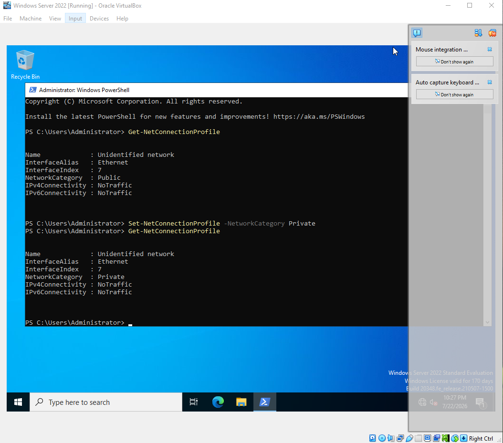
Get-NetConnectionProfile before and after Set-NetConnectionProfile -NetworkCategory Private, showing the category change from Public to Private.

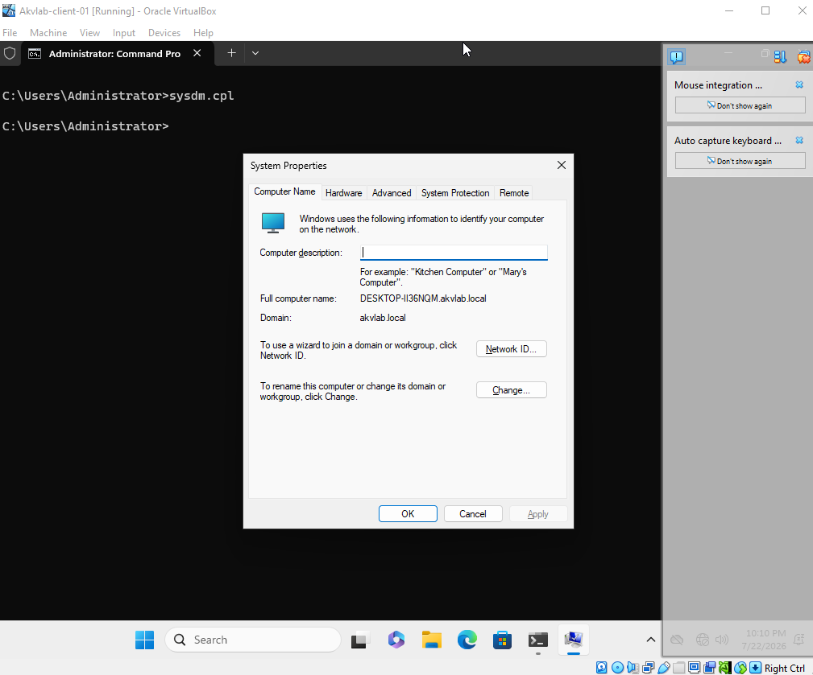
System Properties on the client confirming domain membership in akvlab.local.

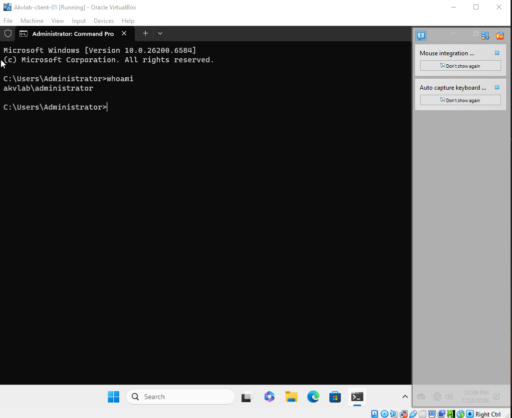
whoami on the client confirming a domain identity after the join.

## Task 2: Group Policy

**Objective:** Configure a domain password policy and an interactive logon banner via Group Policy.

**Steps Taken**
* Configured the password policy in the Default Domain Policy, linked at the domain root: minimum password length 10, maximum password age 60 days, complexity enabled
* Configured an interactive logon banner via GPO with a message title and message text
* Verified the applied settings with gpresult and by checking the registry on the client

**Issue Encountered and Fix**
I recorded the password policy outcome as minimum length 10 with complexity enabled. That was not fully accurate. During Task 4, running `Get-ADDefaultDomainPasswordPolicy` showed the applied minimum password length was actually 6, and that reversible encryption was enabled when it should not have been. I had not verified the applied value at the time, only what I had set in the GPO editor. Both were corrected during Task 4 and reverified from the cmdlet output. See Task 4 below.

**Screenshots**

Account Policies in the Default Domain Policy. Minimum password length shows 6 characters and reversible encryption shows Enabled, the values later corrected in Task 4.

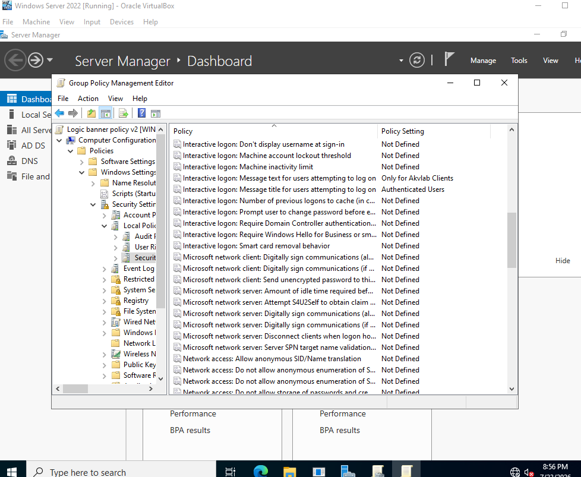
Interactive logon message title and message text configured in Group Policy.

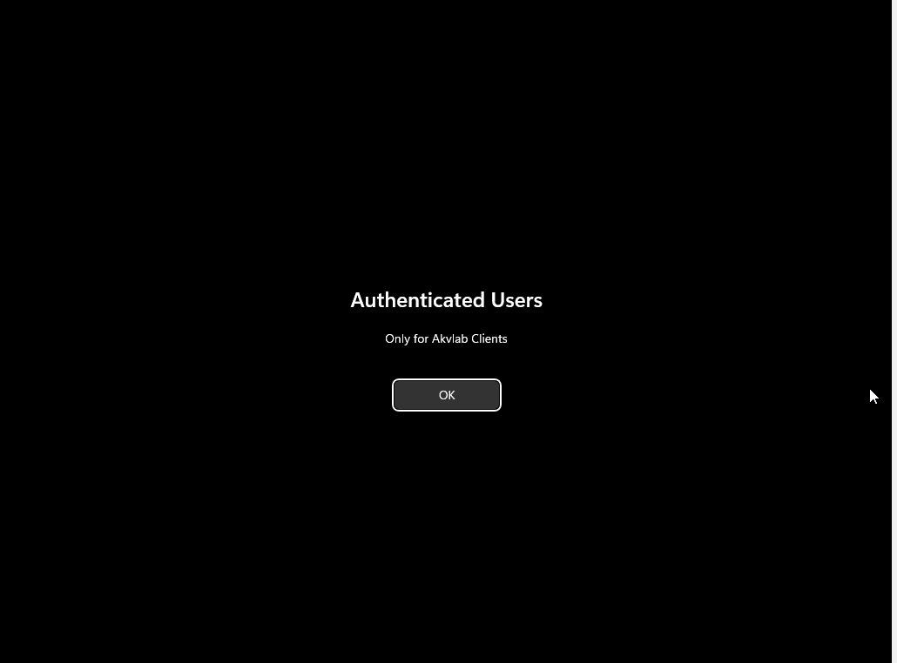
The logon banner as displayed at the client sign in screen.

## Task 3: Shared Folder with NTFS and Share Permissions

**Objective:** Create a departmental file share with a layered share and NTFS permission model.

**Steps Taken**
* Created `C:\Shares\Finance` on the domain controller and shared it as `Finance`, reachable at `\\WIN-QCCH93AVUST\Finance`
* Set share permissions: `SG_Finance_Read` Read, `SG_Finance_Modify` Change, Domain Admins Full Control
* Broke NTFS inheritance and set `SG_Finance_Read` to Read and Execute, `SG_Finance_Modify` to Modify, alongside SYSTEM, Administrators and CREATOR OWNER
* Verified access from the client as both `jdoe` (SG_Finance_Read) and `asingh` (SG_Finance_Modify)

**Issues Encountered and Fixes**
* A stacked dialog chain silently discarded a share permission change. It appeared to save but had not applied. Fixed by reopening each dialog and confirming the value persisted.
* NTFS ACEs were applied to the parent `C:\Shares` folder instead of the `Finance` share folder. Caught by reading the SDDL flags in `Get-Acl` output rather than trusting the GUI.
* Access denied for a test user, caused by the security groups being empty combined with a stale logon token. Fixed by populating the groups and doing a full sign out and sign in rather than a lock and unlock.

**Screenshots**

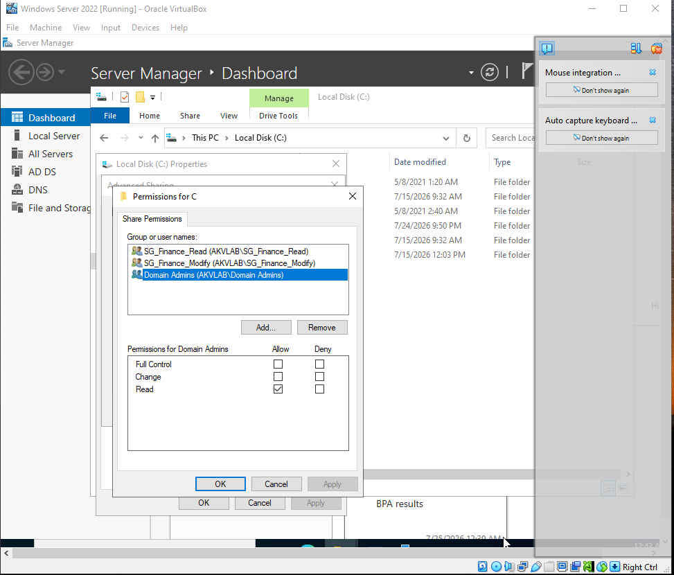
Share permissions listing SG_Finance_Read, SG_Finance_Modify and Domain Admins.

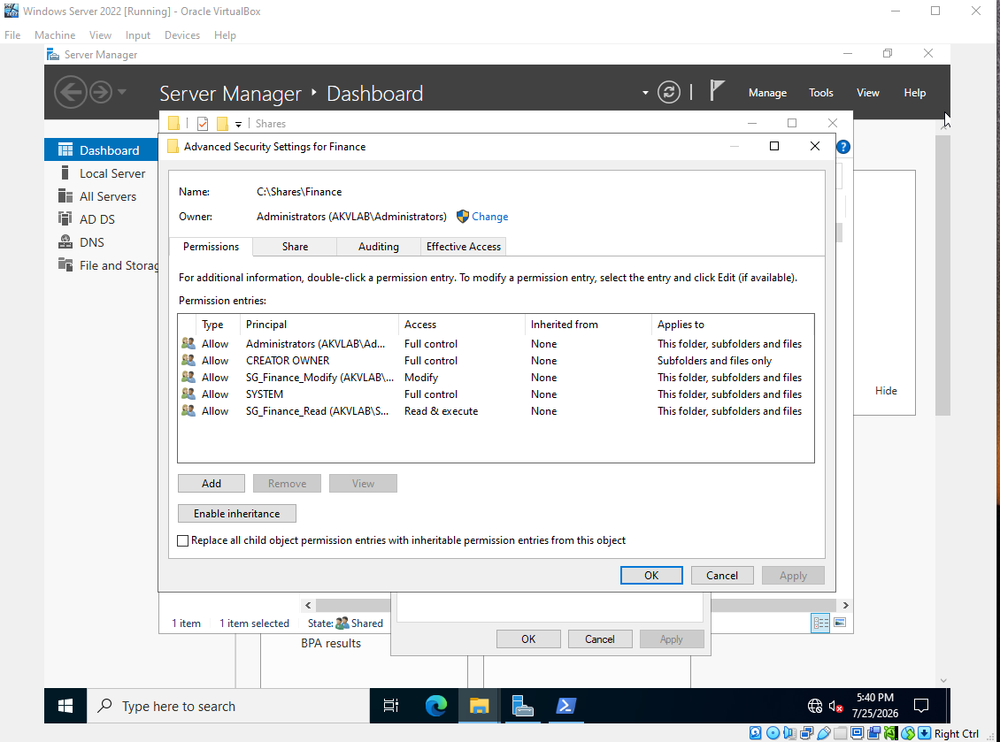
Advanced Security Settings for the Finance folder after breaking inheritance: SG_Finance_Read at Read & execute, SG_Finance_Modify at Modify, alongside SYSTEM, Administrators and CREATOR OWNER.

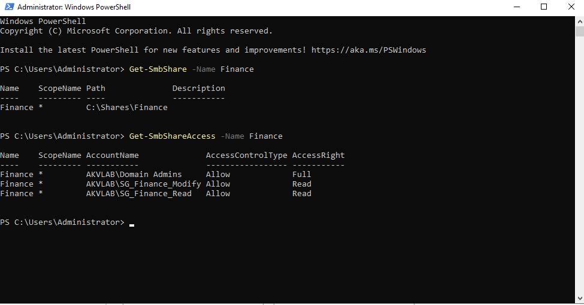
Get-SmbShare and Get-SmbShareAccess confirming the Finance share path and share level permissions.

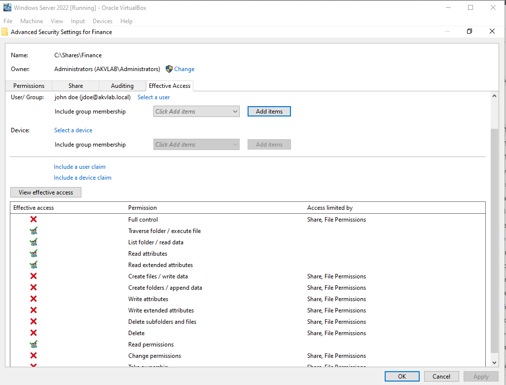
Advanced Security effective access check for john doe, matching Read & execute.

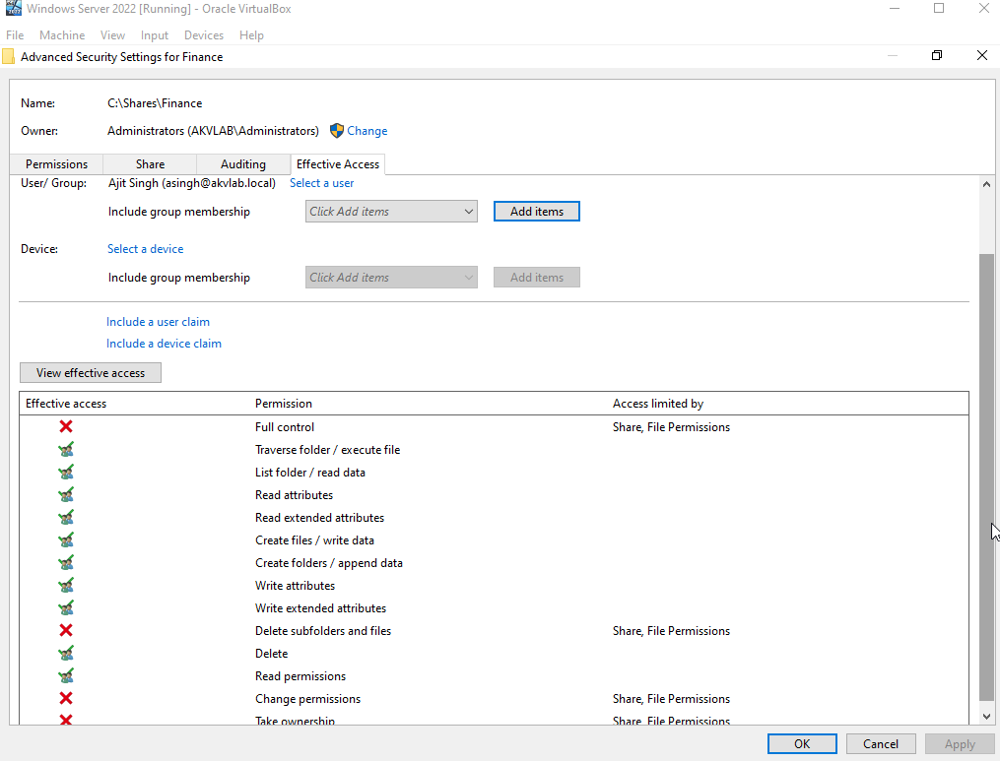
Advanced Security effective access check for Ajit Singh, matching Modify.

jdoe opening and reading budget.txt in the Finance share from the client.

Access denied when jdoe attempts to save changes to budget.txt, consistent with Read & execute only.

asingh successfully saving a change to budget.txt in the Finance share.

## Task 4: Help Desk Scenarios Logged in ServiceNow

**Objective:** Run two common help desk scenarios end to end in the lab domain and log each as a ticket in a ServiceNow Personal Developer Instance.

**Steps Taken**
* Configured an account lockout policy (threshold 5 invalid attempts, lockout duration 15 minutes, observation window 15 minutes) and triggered a real lockout for `jdoe` from the client
* Unlocked the account in Active Directory Users and Computers and confirmed a successful logon
* Logged the lockout as incident INC0010002 with caller, category, impact, urgency, work notes and resolution
* Created a new starter account in the Finance OU, added it to `SG_Finance_Read`, and verified access from the client after a full sign out and sign in
* Logged the onboarding as incident INC0010003 with the same field discipline

**Issue Encountered and Fix**
The default domain lockout threshold was 0, meaning accounts never locked out, so the lockout policy had to be configured before the scenario was possible at all. While checking the lockout settings I also caught the Task 2 password policy discrepancy noted above. Separately, ServiceNow's Caller and Assigned to fields are reference fields that only accept existing records, so typing a name directly fails; I created a matching user record first and selected it from the lookup.

**Screenshots**

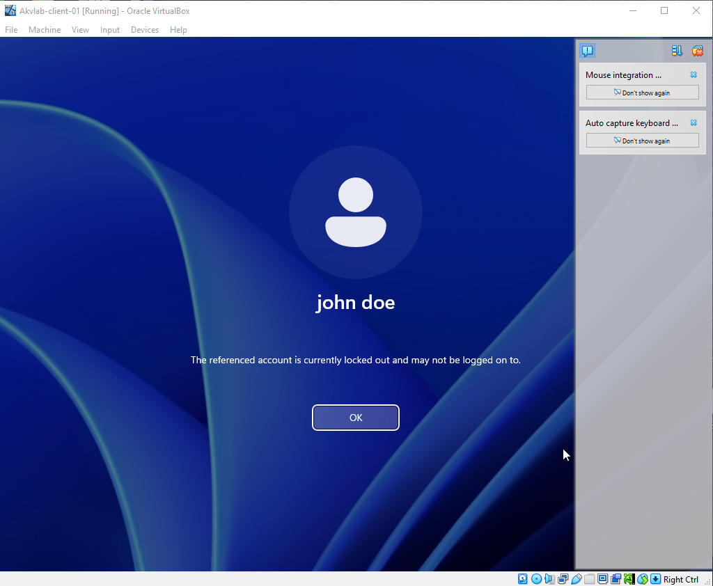
Lockout message at the client logon screen for john doe after exceeding the threshold.

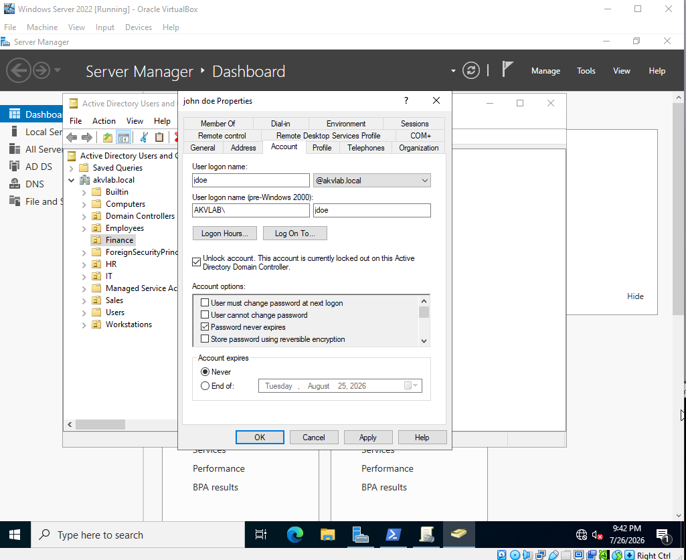
Unlocking the account on the Account tab in Active Directory Users and Computers.

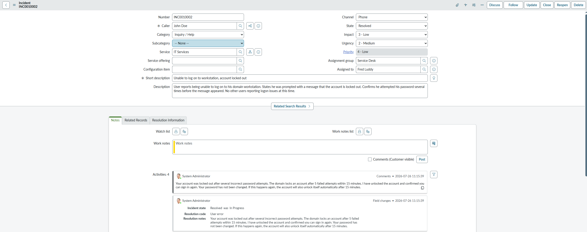
INC0010002 resolved, with caller, classification and resolution notes.

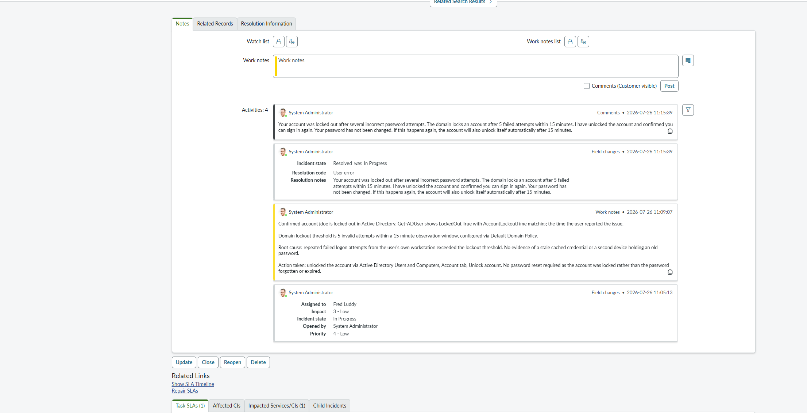
Work notes for INC0010002, including root cause and action taken.

whoami /groups on the client confirming SG_Finance_Read membership for the new starter.

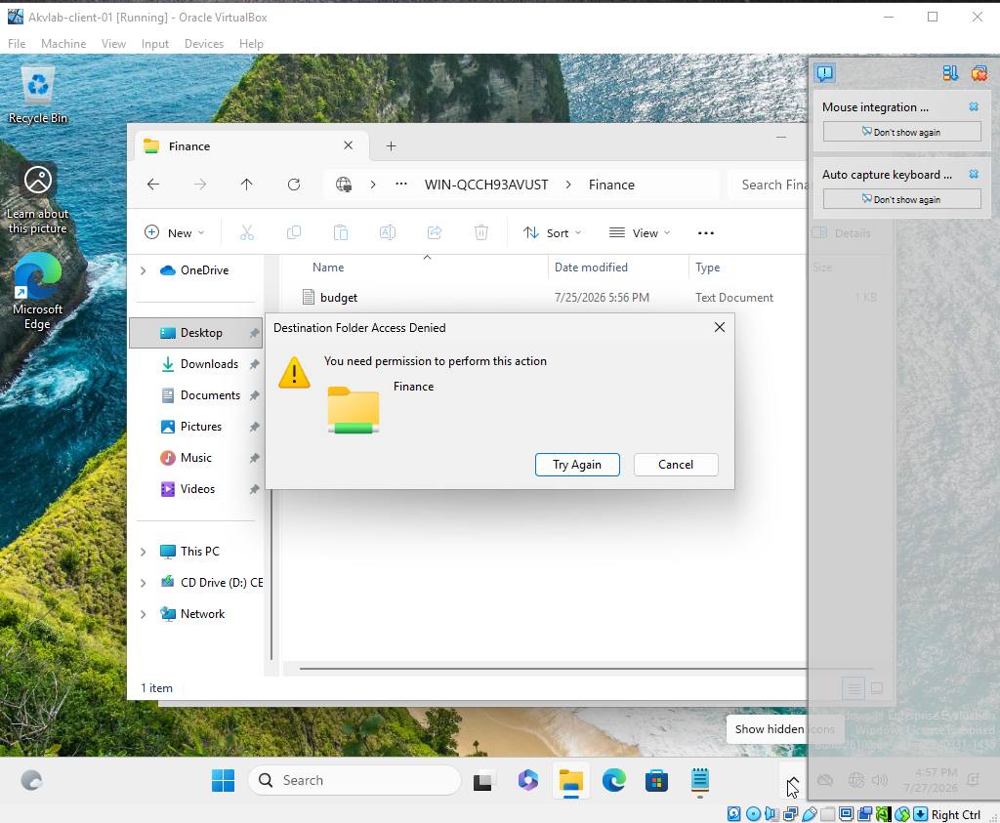
Access denied when the new starter attempts to create a file in the Finance share, confirming read only access.

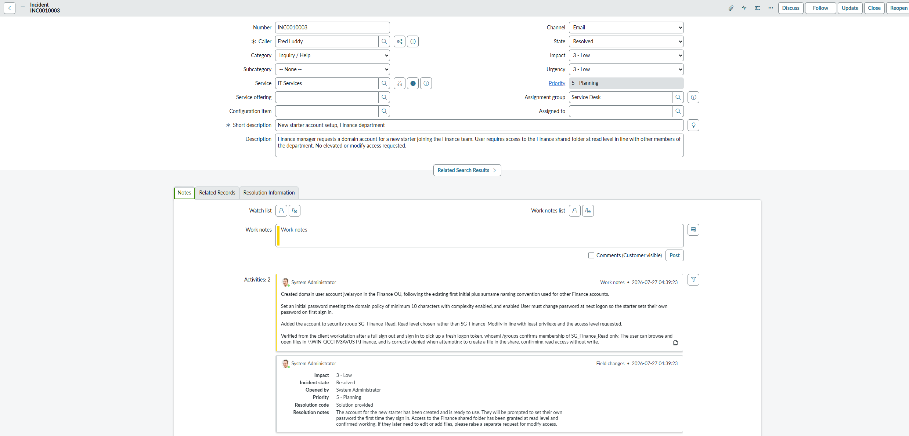
INC0010003 resolved, with resolution notes.

## Scope

This is a lab built on a single domain controller and one client, not a production or enterprise environment. The ServiceNow instance is a free developer instance with demo data, so caller records and assignment groups are stand ins rather than a real service desk configuration. The Task 2 password policy discrepancy is left visible rather than corrected retroactively, because catching it late was itself part of the lesson.
